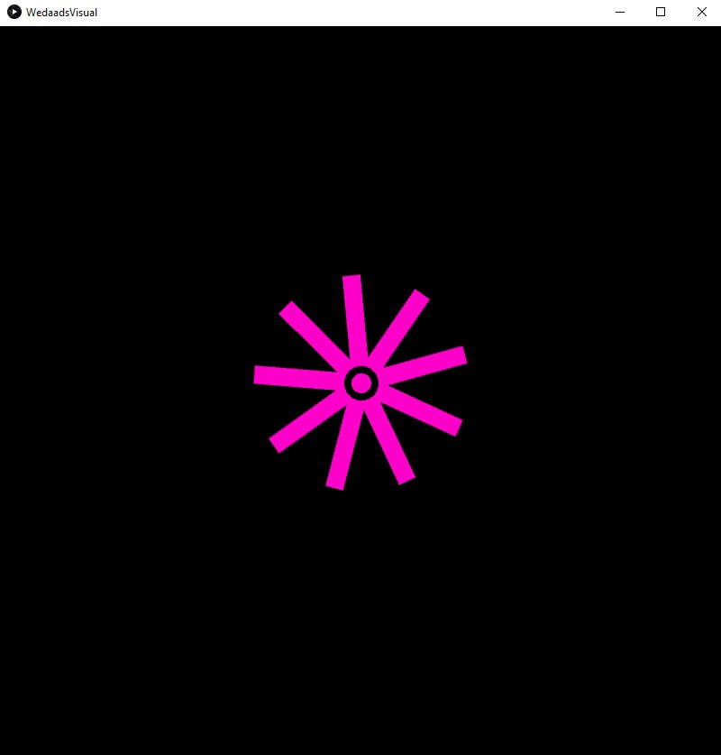
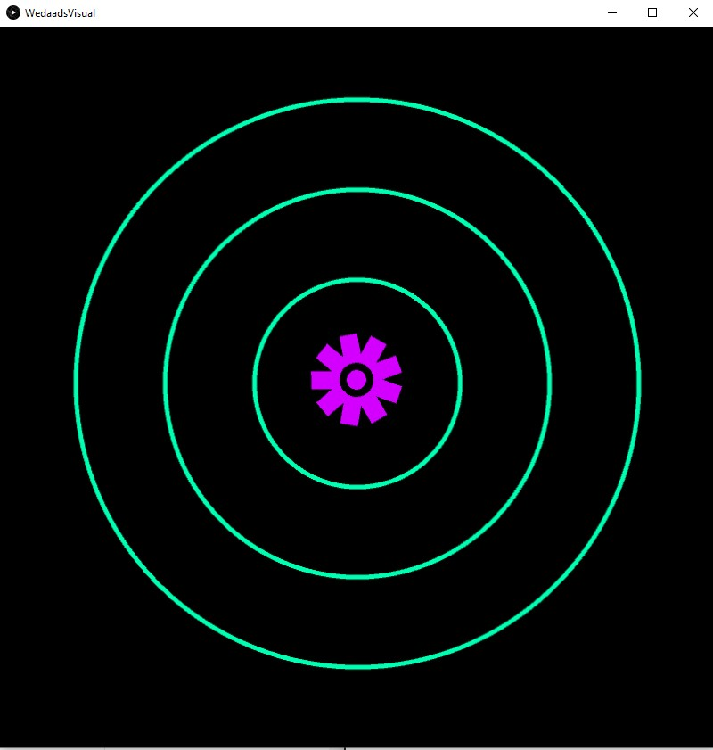
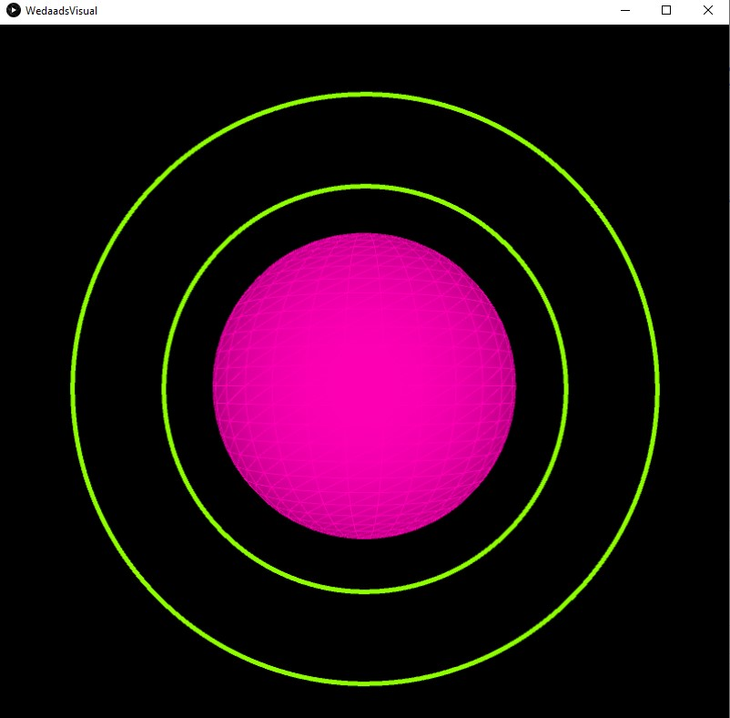
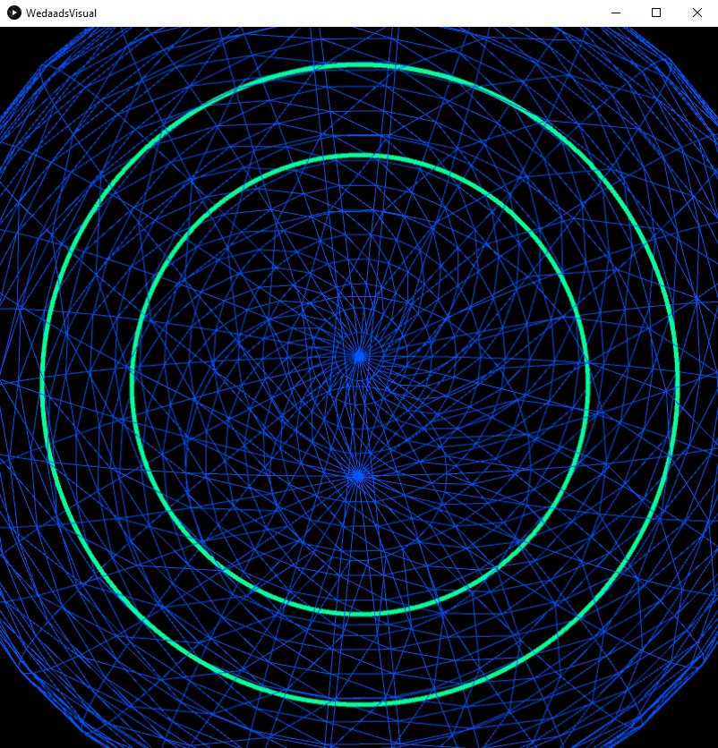
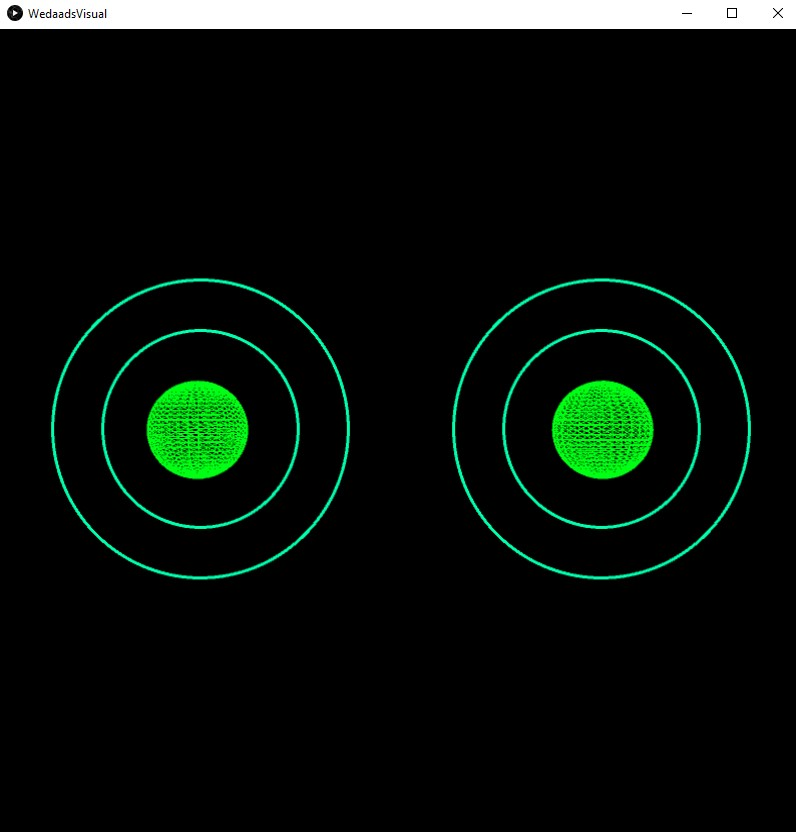

# Music Visualiser Project

Name: Wedaad Haruna

Student Number: C19303066

# Description of the assignment
The aim of this assignment was to create "somthing beautiful to enjoy while listening to music." 

My assignment was inspired by stereos. At the beginning a pink sphere is rendered to the screen. Over the course of my visual the sphere goes through differnet stages. I thought of it as the stereo's life cycle. At the beginning the stereo is just a whole sphere but as the music changes and gets louder the stereo evolves. 

The stereo changes to a purple flower surrounded by three circles. The flower changes back into the pink sphere but this time only surrounded by two circles. As the song gets louder the stereo has a different look. This time the stereo is a rotating sphere and it represents more of a spiral sphere surrounded by two circles. When the music is really loud the steeo opens up allowing you to feel the music.  

The stereo now splits into two stereo speakers. Similar to the last stereo these two stereos are surrounded by two circles along with a spiral sphere center. After this change the stereo is now rendered to the screen in its simplest form as a flower. 

I created a stereo system but with a twist. I wanted a stereo system that is very colourful and unique. My visuals respond to music and when the music gets load or when the amplitude is increase the colour and size of the visuals change.

---

## Instructions
- Press the space bar - once pressed the song Already starts playing and the visual starts to move according to the music
- To change the visual on the screen use the number keys from 0 - 5 (inclusive) which calls the different visual classes within a switch case in WedaadVisual.java
- When no key is pressed at the beginning you will see a flower
- when key 1 is pressed two circles along with a flower are rendered to the screen
- When key 2 is press two circles and a sphere are rendered to the screen
- When keys 3 - 5 are pressed different visuals are rendered to the screen

1. Press the space bar to start playing the song with the viusal. The visual works best with Already.mp3
2. The main method calls on WedaadsVisual
3. Run the main method

Enjoy! 

---

# How it works

I made different classes for each visual and I made instances of all of these classes in the WedaadVisual class. Using polymorphism allowed me to reuse attributes and methods of WedaadsVisual in the other classes as well as call methods from the other visual classes in WedaadsVisual.java. The WedaadsVisual class uses inheritance as it extends  the Visual class:

```Java
	public class WedaadsVisual extends Visual {

	    Flowers flowers;
	    Circle circle;
	    Sphere sphere;
	    SpiralSphere ssphere;
	    SplitVisual sVisual;
	    TwoCircles tCircles;

	}
```

Each class has WedaadVisual as a an instance `WedaadsVisual wv` and a constructors that takes `wv` as a parameter allowing the other classes to use variables in `WedaadsVisual.java`.

The `setup()` method loads the audio that plays along with the video. You can also find the instances og each visual class in the `setup()` method.

I use a switch case to switch between the visuals. The switch case is in the `draw()`. I wrote a methode `keyPressed()` that checks the code of any key pressed between the values 0 and 5 (inclusive) and this code is assigned to the variable `visualNo` which the switch case uses to change the visuals. 

`keyPressed()` Method: 

```Java
	int visualNo = 0;

	    public void keyPressed()
	    {
		if (key == ' ')
		{
		    getAudioPlayer().cue(0); //same as rewind - goes back to start 
		    getAudioPlayer().play();
		}
		if (keyCode >= '0' && keyCode <= '5' )
		{
		    visualNo = keyCode - '0';
		}
	    }

```

Switch case: 

```Java
	switch (visualNo) { 

		    case 0: { //flowers

			flowers.render();
			flowers.updatePosition();
			break;
		    }//ends case 0

		    case 1: {

			flowers.render();
			flowers.updatePosition();
			circle.render();
			break;
		    }//ends case 1 

		    case 2: {

			tCircles.render();
			sphere.render();
			break;

		    }//ends case 2

		    ...
```

To start up the visual you need to:

1. Press Fn + F5
2. Press the space bar to start playing the song with the viusal. The visual works best with Already.mp3
3. The main method calls on WedaadsVisual
4. And enjoy my visuals

You will find my visual on the master branch. While developing my assignment I made one branch one called WIP. I merged the WIP branch with the master branch once I was happy with my visual.

---

# What I am most proud of in the assignment

I am very proud that I was able to render a flower to the screen. At the beginning the flower wasnt able to move or rotate. After a couple of tries I wrote a `updatePosition()` method and a `moveFolwer()` method in the flower class. The `updatePosition()` is called in the `draw()` method when the flower is rendered to the screen. These methods allowed me to increase the size of the flower petals as well as restric how long the petals can get. The colour and the size of the flower changes when the amplitude of the songs increases. As the flower rotates and the petals increase in size it gives it a spinning effect which I really like. 

This code restricts the length of the petals:

```Java
	void updatePosition() {

		x += dy;
		y += dx;
		rotation += 0.05f;

		if( x > wv.width / 16 || y > wv.height / 16) {

		    moveFlower();

		}

	    }

```

This code renders the flower to the screen:

```Java

	public void render() { // drawing the flower

		wv.pushMatrix();
		wv.background(0);
		wv.calculateAverageAmplitude();
		wv.stroke(PApplet.map(wv.getSmoothedAmplitude(), 0, 1, 200, 255), 255, 255);
		wv.strokeWeight(flowerSize);
		wv.noFill();
		wv.translate(400, 400, 0);
		wv.rotateZ(PApplet.PI / 8);


		for(int i = 0; i < petalNo; i++) {

		    wv.rotate(PApplet.TWO_PI / petalNo);
		    wv.line(0, 0, y, 25 + wv.lerpedAverage * (10 * flowerSize));


		}

		wv.stroke(0);
		wv.strokeWeight(8);
		wv.ellipse(0, 0, (float) 1.5 * flowerSize, (float) 1.5 * flowerSize);
		wv.popMatrix();

	    }


```

---

## Images 

- The flower: 



- The flower surrounded by circles:



- The sphere surrounded by circles:



- Entering inside the spiral sphere to feel the music:



- The two stereos: 



---

## YouTube Video

Here is the link to my YouTube video: 


